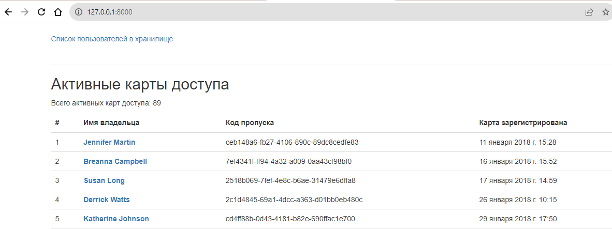

# Пульт охраны банка
Пульт управления для охранников банка, помогает следить за всеми, кто находится внутри хранилища.

## Как установить
- Получите права доступа к базе данных сотрудников.
- Заполните эти данные в файл по путиЖ /project/settings.py
- Для изоляции проекта рекомендуется развернуть виртуальное окружение:
```
python3 -m venv env
source env/bin/activate
```
- Python3 должен быть уже установлен. Затем используйте pip (или pip3, есть конфликт с Python2) для установки зависимостей:
```
pip install -r requirements.txt
```

## Использование
- Запуск пульта:
```
py main.py
```
- Панель пульта находится по адрессу: http://127.0.0.1:8000/
- На главной страницк пульта находится вывод активных карт доступа

- 

## Цель проекта
Код написан в образовательных целях на онлайн-курсе для веб-разработчиков dvmn.org.
